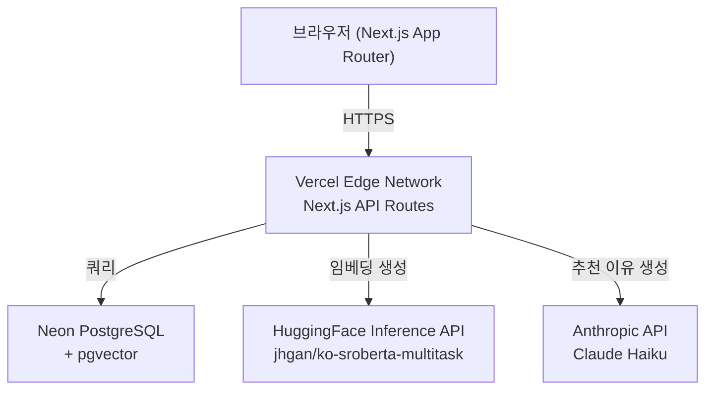
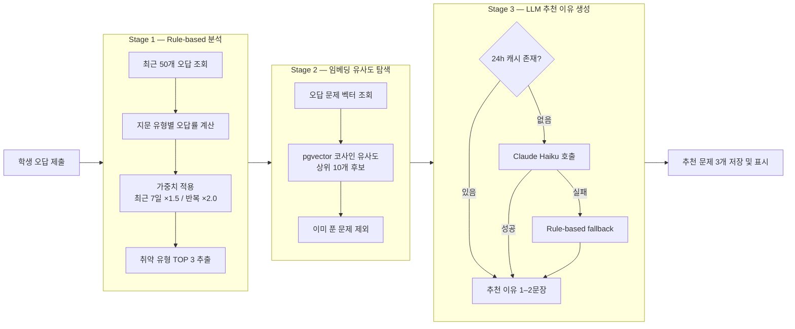
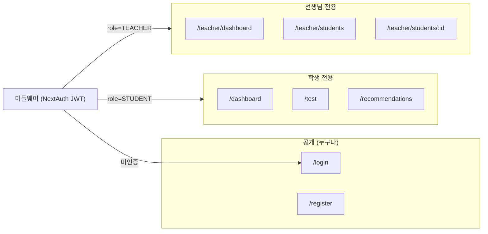

# 수능 국어 AI 취약 문제 추천 시스템

학생의 오답 패턴을 AI로 분석해 수능 국어 기출 문제를 맞춤 추천하고, 선생님이 이를 검토·관리할 수 있는 웹 애플리케이션입니다.

---

## 주요 기능

### 학생
- **문제 풀기** — 지문 유형(독서·문학·화작·언매)별 필터로 기출 문제 풀이, 제출 즉시 정오답 및 해설 확인
- **취약 영역 대시보드** — 지문 유형별 정답률 레이더 차트, 30일 오답 추이 그래프, 취약 유형 TOP 3
- **AI 추천 문제** — 오답 패턴 기반으로 오늘 풀어야 할 문제 3개 자동 추천, 추천 이유 1줄 제공

### 선생님
- **학생 목록 대시보드** — 반 전체 학생의 평균 정답률, 취약 영역, 최근 활동일 일람
- **학생 상세 분석** — 개별 학생의 오답 패턴 차트 및 AI 추천 문제 목록 열람
- **추천 검토** — AI 추천 문제를 승인(✓) / 제외(✗) 처리하거나 직접 문제 추가

---

## 시스템 아키텍처



### AI 추천 파이프라인 (3단계)



### 라우트 및 권한 구조



---

## 기술 스택

| 영역 | 기술 |
|------|------|
| Frontend | Next.js 16 (App Router), Tailwind CSS v4, shadcn/ui, Recharts |
| Backend | Next.js API Routes, Prisma 6, NextAuth.js v5 |
| Database | PostgreSQL (Neon) + pgvector |
| AI — 임베딩 | HuggingFace `jhgan/ko-sroberta-multitask` (768dim, 무료) |
| AI — LLM | Anthropic Claude Haiku |
| 배포 | Vercel |
| 테스트 | Vitest, Testing Library, Playwright (E2E) |
| 패키지 매니저 | pnpm |

---

## 로컬 개발 환경 설정

### 사전 요구사항

- Node.js 20+
- pnpm (`npm install -g pnpm`)
- [Neon](https://neon.tech) — PostgreSQL DB (무료 가입)
- [Anthropic](https://console.anthropic.com) — Claude API 키
- [HuggingFace](https://huggingface.co/settings/tokens) — Inference API 키

### 설치 및 실행

```bash
# 1. 의존성 설치
pnpm install

# 2. 환경 변수 설정
cp .env.local.example .env.local
# .env.local 편집 (아래 환경 변수 목록 참고)

# 3. DB 마이그레이션 및 시드 데이터 적재
pnpm prisma migrate dev
pnpm prisma db seed

# 4. 개발 서버 시작
pnpm dev
# → http://localhost:3000
```

### 환경 변수

| 변수 | 필수 | 설명 |
|------|------|------|
| `DATABASE_URL` | ✅ | Neon Pooled Connection URL |
| `DIRECT_URL` | ✅ | Neon Direct Connection URL (마이그레이션용) |
| `NEXTAUTH_SECRET` | ✅ | 랜덤 32자 문자열 (`openssl rand -base64 32`) |
| `NEXTAUTH_URL` | ✅ | 로컬: `http://localhost:3000` |
| `ANTHROPIC_API_KEY` | ✅ | Claude API 키 (`sk-ant-...`) |
| `HUGGINGFACE_API_KEY` | ✅ | HuggingFace 토큰 (`hf_...`) |
| `NEXT_PUBLIC_USE_LLM` | ❌ | `"false"` 설정 시 LLM 없이 Rule-based만 동작 |

> **Neon URL 팁:** Neon 대시보드 Connection Details에서 `-pooler`가 붙은 URL이 `DATABASE_URL`, 제거한 URL이 `DIRECT_URL`입니다.

---

## 테스트 실행

```bash
pnpm test            # 단위 + 통합 테스트 (Vitest)
pnpm test:coverage   # 커버리지 리포트
pnpm test:e2e        # E2E 테스트 (Playwright, 서버 실행 필요)
pnpm typecheck       # TypeScript 타입 검사
pnpm lint            # ESLint
```

---

## 프로젝트 구조

```
src/
├── app/
│   ├── (auth)/          # 로그인, 회원가입 페이지
│   ├── (student)/       # 학생 전용 페이지
│   ├── (teacher)/       # 선생님 전용 페이지
│   └── api/             # API Routes
│       ├── auth/        # NextAuth
│       ├── questions/   # 문제 조회
│       ├── sessions/    # 테스트 세션 및 답안 제출
│       ├── recommendations/ # AI 추천
│       ├── analytics/   # 분석 데이터
│       ├── teacher/     # 선생님용 API
│       └── admin/       # 임베딩 일괄 생성 (관리자)
├── components/
│   ├── charts/          # Recharts 차트 컴포넌트
│   ├── question/        # 문제 카드, 정오답 피드백
│   ├── recommendation/  # 추천 카드
│   └── teacher/         # 학생 테이블, 추천 검토 UI
├── lib/
│   ├── ai/              # 임베딩, 유사도, 추천 엔진, LLM 클라이언트
│   ├── auth.ts          # NextAuth 설정
│   └── db.ts            # Prisma 싱글톤 클라이언트
├── hooks/               # React Query 훅
├── types/               # TypeScript 타입 정의
└── constants/           # 지문 유형 상수

prisma/
├── schema.prisma        # DB 스키마
└── seed/
    ├── index.ts         # 시드 스크립트
    └── questions/       # 샘플 문제 JSON
```

---

## Vercel 배포

```bash
# Vercel CLI 설치 및 연결
pnpm add -g vercel
vercel login
vercel link

# Vercel 대시보드에서 환경 변수 설정 후 배포
vercel --prod
```

**Build Command (Vercel 설정):**
```
prisma migrate deploy && next build
```

GitHub `main` 브랜치에 push하면 GitHub Actions CI가 실행되고, 통과 시 Vercel에 자동 배포됩니다.

---

## 상세 문서

| 문서 | 설명 |
|------|------|
| [docs/ARCHITECTURE.md](./docs/ARCHITECTURE.md) | 시스템 아키텍처 상세 |
| [docs/DATABASE_SCHEMA.md](./docs/DATABASE_SCHEMA.md) | Prisma 스키마 명세 |
| [docs/AI_ENGINE.md](./docs/AI_ENGINE.md) | AI 추천 엔진 상세 |
| [docs/TEST_CONVENTIONS.md](./docs/TEST_CONVENTIONS.md) | 테스트 작성 규칙 |
| [docs/COMMIT_CONVENTIONS.md](./docs/COMMIT_CONVENTIONS.md) | Git 커밋 컨벤션 |

---

## 제약 사항 (v1)

- 수능 수학·영어 미포함 (국어 전용)
- 동시 사용자 100명 이하 기준 설계
- 무료 티어 기준: Neon 0.5GB, HuggingFace 무료 API, Vercel Hobby
- 학생당 LLM 추천 이유 생성 일 3회 한도 (비용 제어)
- 문제 데이터는 수동 입력 방식 (자동 크롤링 미지원)
